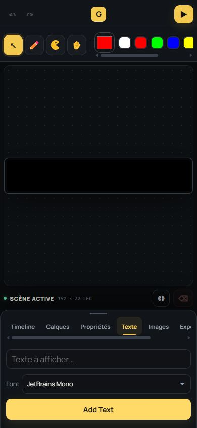
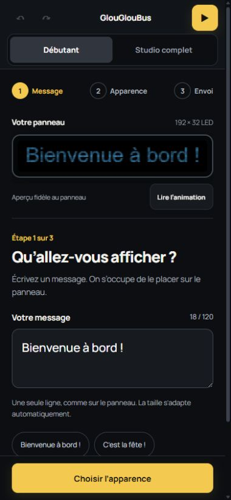
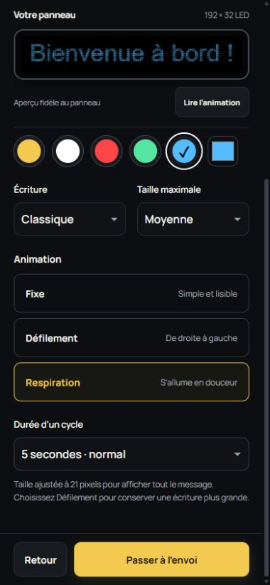
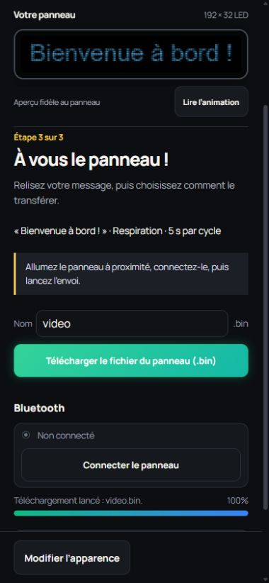
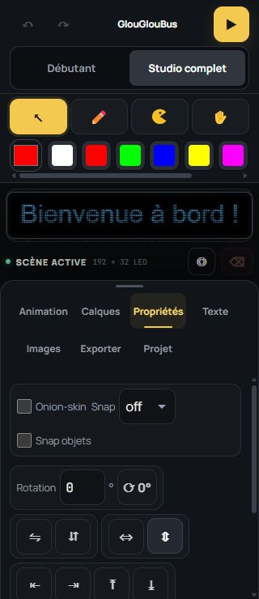

# Refonte mobile du configurateur GlouGlouBus

## Diagnostic de l’interface initiale

Capture dans le navigateur intégré, en portrait 390 × 844, pendant cette intervention.

1. **Entrée dans l’éditeur — difficile pour un débutant.** Le panneau vide, la palette et les outils ne proposent aucun premier geste explicite. La timeline apparaît avant la création d’un message.
2. **Ajout de texte — trop dispersé.** Le champ et le bouton sont accessibles, mais le placement, la couleur, la taille et l’animation sont répartis entre plusieurs espaces. Les termes « Font » et « Add Text » rompent la cohérence avec les autres libellés français.
3. **Export — difficile à découvrir.** Les derniers onglets débordent horizontalement. Le code utilise uniquement `showSaveFilePicker`, ce qui empêche l’export sur les navigateurs ne proposant pas cette API.

Les boutons de 26 à 40 px observés dans la palette et la barre supérieure sont peu confortables au doigt. Le blocage du zoom de page est également retiré. Cette revue ne constitue pas une certification d’accessibilité.

## Parcours livré

### 1. Message — vérifié

Le mode Débutant est proposé par défaut. Un champ, des exemples facultatifs, un compteur de caractères et une action principale guident la création. Le texte est placé et dimensionné automatiquement. Un message vide bloque la progression. Les messages longs suggèrent le défilement.

### 2. Apparence — vérifiée

Couleurs nommées, couleur personnalisée, trois écritures, trois tailles maximales et trois presets : fixe, défilement, respiration. Les animations proposent des cycles de 3, 5 ou 8 secondes. La lecture et la pause fonctionnent avec le moteur existant. L’aperçu reste visible pendant le défilement, ainsi que les actions en bas de l’écran.

### 3. Envoi — téléchargement vérifié, Bluetooth physique à tester

Le récapitulatif précède les actions. Le fichier .bin utilise la disposition matérielle du GlouGlouBus dans le mode débutant. Sur mobile, le téléchargement standard remplace le sélecteur de fichier. Un état de progression confirme le lancement du téléchargement. Le projet modifiable reste enregistrable séparément.

Les commandes Bluetooth existantes sont réutilisées. L’interface détecte une API indisponible ou un contexte non sécurisé et présente une alternative. Le matériel n’a pas été connecté pendant cette intervention.

### 4. Studio complet — vérifié sur téléphone et ordinateur

Le sélecteur de mode conserve le projet. Les objets générés par les presets sont des objets ordinaires du moteur v3. Une modification avancée révoque la gestion automatique du message : un retour au mode débutant ne remplace donc pas silencieusement cette composition.

Sur téléphone, les onglets se répartissent sur deux lignes, les commandes sont agrandies et la hauteur maximale des réglages réserve une place lisible au panneau. Les onglets exposent leur sélection et permettent une navigation par flèches au clavier ; les contrôles du panneau replié ne sont plus accessibles au focus.

## Validation

- `npm test` : 7 tests réussis — ajustement du texte, centrage, défilement, respiration, limites de saisie, restauration et protection des compositions avancées.
- `npm run build` : compilation de production réussie.
- `git diff --check` : aucun défaut de whitespace.
- Vérification visuelle à 320 × 740, 390 × 844 et 1366 × 900, avec le navigateur intégré.
- Parcours réellement manipulés : message, couleur, presets, lecture/pause, navigation des étapes, message vide, annulation, restauration de la sauvegarde automatique, téléchargement .bin, enregistrement du projet et changements de mode.
- Mesure à 390 px : largeur du document égale à sa largeur de défilement, aperçu fixé en haut lors du défilement et barre d’actions au bas du viewport.
- Aucune erreur de console lors du dernier parcours.

Limites : pas d’essai sur panneau physique, avec clavier virtuel réel, ni avec VoiceOver/TalkBack. Le mode débutant simplifie la création de messages ; les images, dessins et compositions complexes restent dans le studio complet.

## Organisation du code

`modules/beginner.js` contient le parcours guidé ; `modules/beginner-scene.js` produit les objets et vérifie leur appartenance au mode débutant ; `styles/mobile.css` adapte le parcours et le studio. L’état du mode est mémorisé localement ; les réglages du message sont inclus dans le projet et son historique. Le cache du service worker passe à v5.
