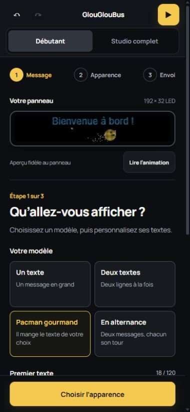

# Modèles du mode débutant

Quatre modèles sont disponibles à l’étape Message :

- **Un texte** : un message sur toute la hauteur, avec les animations existantes.
- **Deux textes** : deux lignes centrées, avec des couleurs indépendantes et une taille adaptée à 192 × 32 LED.
- **Pacman gourmand** : deux lignes ; l’utilisateur choisit laquelle Pacman mange. Une pause au départ laisse lire le panneau, puis Pacman traverse la ligne. L’autre texte est dessiné au-dessus de l’effacement et des miettes pour rester intact. La scène recommence à chaque boucle.
- **En alternance** : deux messages affichés chacun pendant une moitié du cycle, sans chevauchement ni image vide entre eux.

Les textes, couleurs, modèle, durée et cible de Pacman sont enregistrés dans le projet. Un changement de modèle remplace tous les objets qu’il gère, en conservant les autres éléments. L’annulation restaure la composition entière. Les projets issus du premier éditeur débutant sont repris sans duplication. Toute modification avancée d’un objet du modèle protège ensuite la composition contre un remplacement automatique.

## Vérifications

- 16 tests réussis via `npm test`, compilation via `npm run build`, aucun défaut relevé par `git diff --check`.
- Interface manipulée à 390 × 844 et 320 × 740 : choix des modèles, saisie du deuxième texte, cible de Pacman, lecture et pause, réglages conditionnels, alternance, annulation et restauration de sauvegarde.
- Export .bin du modèle Pacman : téléchargement lancé, progression à 100 %, aucune erreur de console.
- Rendu observé : Pacman mange le deuxième texte, le premier reste intact. Les deux cibles sont également vérifiées dans les tests du moteur de scène.
- Pas d’essai de transmission sur le panneau physique.

